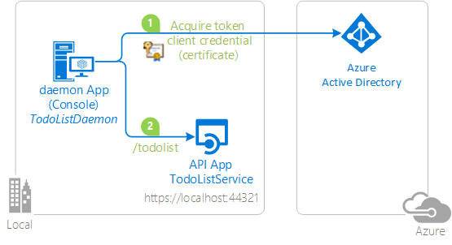

# Authenticating to Azure AD in daemon apps with certificates


## About this sample

### Overview

In this sample, a Windows console application (TodoListDaemonWithCert) calls a web API (TodoListService) using its app identity. This scenario is useful for situations where headless or unattended job or process needs to run as an application identity, instead of as a user's identity. The application uses the Active Directory Authentication Library (ADAL) to get a token from Azure AD using the OAuth 2.0 client credential flow, where the client credential is a certificate.

This sample is similar to [Daemon-DotNet](https://github.com/Azure-Samples/active-directory-dotnet-daemon), except instead of the daemon using a password as a credential to authenticate with Azure AD, here it uses a certificate.



### Scenario

Once the service started, when you start the `TodoListDaemon` desktop application, it repeatedly:

- adds items to the todo list maintained by the service,
- lists the existing items.

No user interaction is involved.


## How to run this sample

To run this sample, you'll need:

- [Visual Studio 2017](https://aka.ms/vsdownload)
- An Internet connection
- An Azure Active Directory (Azure AD) tenant. For more information on how to get an Azure AD tenant, see [How to get an Azure AD tenant](https://azure.microsoft.com/en-us/documentation/articles/active-directory-howto-tenant/)
- A user account in your Azure AD tenant. This sample will not work with a Microsoft account (formerly Windows Live account). Therefore, if you signed in to the [Azure portal](https://portal.azure.com) with a Microsoft account and have never created a user account in your directory before, you need to do that now.

### Step 1:  Clone or download this repository

You can clone this repository from Visual Studio. Alternatively, from your shell or command line, use:

`git clone https://github.com/Azure-Samples/active-directory-dotnet-daemon-certificate-credential.git`

There are two projects in this sample. Each needs to be separately registered in your Azure AD tenant. To register these projects, you can:

- either follow the steps in the paragraphs below ([Step 2](#step-2--register-the-sample-with-your-azure-active-directory-tenant) and [Step 3](#step-3--configure-the-sample-to-use-your-azure-ad-tenant))
- or use PowerShell scripts that:
  - **automatically** create for you the Azure AD applications and related objects (passwords, permissions, dependencies)
  - modify the Visual Studio projects' configuration files.

If you want to do use this automation, read the instructions in [App Creation Scripts](./AppCreationScripts/AppCreationScripts.md)

> For Windows Server 2012, creating a certificate with PowerShell is slightly different: See issue [#37](https://github.com/Azure-Samples/active-directory-dotnet-daemon-certificate-credential/issues/37)

#### First step: choose the Azure AD tenant where you want to create your applications

As a first step you'll need to:

1. Sign in to the [Azure portal](https://portal.azure.com).
1. On the top bar, click on your account and under the **Directory** list, choose the Active Directory tenant where you wish to register your application.
1. Click on **All services** in the left-hand nav, and choose **Azure Active Directory**.

#### Register the service app (TodoListService)

1. In the  **Azure Active Directory** pane, click on **App registrations** and choose **New application registration**.
1. Enter a friendly name for the application, for example 'TodoListService' and select 'Web app / API' as the *Application Type*.
1. For the *sign-on URL*, enter the base URL for the sample, which is by default `https://localhost:44321/`.
1. Click on **Create** to create the application.
1. In the succeeding page, Find the *Application ID* value and copy it to the clipboard. You'll need it to configure the Visual Studio configuration file for this project.
1. Then click on **Settings**, and choose **Properties**.
1. For the App ID URI, replace the guid in the generated URI 'https://\<your_tenant_name\>/\<guid\>', with the name of your service, for example, 'https://\<your_tenant_name\>/TodoListService' (replacing `<your_tenant_name>` with the name of your Azure AD tenant)

#### Register the client app (TodoListDaemon)

1. In the  **Azure Active Directory** pane, click on **App registrations** and choose **New application registration**.
1. Enter a friendly name for the application, for example 'TodoListDaemon' and select 'Web app / API' as the *Application Type*.
  > Even if this is a desktop application, this is a confidential client application hence the Application Type
1. For the *Redirect URI*, enter `https://<your_tenant_name>/TodoListDaemon`, replacing `<your_tenant_name>` with the name of your Azure AD tenant.
1. Click on **Create** to create the application.
1. In the succeeding page, Find the *Application ID* value and copy it to the clipboard. You'll need it to configure the Visual Studio configuration file for this project.
1. Then click on **Settings**, and choose **Properties**.
1. For the App ID URI, replace the guid in the generated URI 'https://\<your_tenant_name\>/\<guid\>', with the name of your service, for example, 'https://\<your_tenant_name\>/TodoListDaemon' (replacing `<your_tenant_name>` with the name of your Azure AD tenant)

#### Create a self-signed certificate

To complete this step, you will use the `New-SelfSignedCertificate` Powershell command. You can find more information about the New-SelfSignedCertificat command [here](https://technet.microsoft.com/library/hh848633).

Open PowerShell and run New-SelfSignedCertificate with the following parameters to create a self-signed certificate in the user certificate store on your computer:

```PowerShell
$cert=New-SelfSignedCertificate -Subject "CN=TodoListDaemonWithCert" -CertStoreLocation "Cert:\CurrentUser\My"  -KeyExportPolicy Exportable -KeySpec Signature
```

If needed, you can later export this certificate using the "Manage User Certificate" MMC snap-in accessible from the Windows Control Panel. You can also add other options to generate the certificate in a different
store such as the Computer or service store (See [How to: View Certificates with the MMC Snap-in](https://msdn.microsoft.com/en-us/library/ms788967)).

#### Add the certificate as a key for the TodoListDaemon application in Azure AD

##### Generate a textual file containing the certificate credentials in a form consumable by AzureAD

Copy and paste the following lines in the same PowerShell window. They generate a text file in the current folder containing information that you can use to upload your certificate to Azure AD:

```PowerShell
$bin = $cert.RawData
$base64Value = [System.Convert]::ToBase64String($bin)
$bin = $cert.GetCertHash()
$base64Thumbprint = [System.Convert]::ToBase64String($bin)
$keyid = [System.Guid]::NewGuid().ToString()
$jsonObj = @{customKeyIdentifier=$base64Thumbprint;keyId=$keyid;type="AsymmetricX509Cert";usage="Verify";value=$base64Value}
$keyCredentials=ConvertTo-Json @($jsonObj) | Out-File "keyCredentials.txt"
```

The content of the generated "keyCredentials.txt" file has the following schema:

```Json
[
    {
        "customKeyIdentifier": "$base64Thumbprint_from_above",
        "keyId": "$keyid_from_above",
        "type": "AsymmetricX509Cert",
        "usage": "Verify",
        "value":  "$base64Value_from_above"
    }
]
```

##### Associate the certificate credentials with the Azure AD Application

To associate the certificate credential with the  TodoListDaemon app object in Azure AD, you'll need to edit the application manifest. In the Azure portal app registrations for the  click on **Manifest**. An editor opens enabling you to edit the manifest.
You need to replace the value of the `keyCredentials` property (that is `[]` if you don't have any certificate credentials yet), with the content of the keyCredential.txt file

To do this replacement in the manifest, you have two options:

- Option 1: Edit the manifest in place by clicking **Edit**, replacing the keyCredentials value, and then clicking **Save**.
  > Note that if you refresh the web page, the key is displayed with different properties than what you have input. In particular, you can now see the endDate, and stateDate, and the vlaue is shown as null. This is normal.

- Option 2: **Download** the manifest to your computer, edit it with your favorite text editor, save a copy of it, and **Upload** this copy. You might want to choose this option if you want to keep track of the history of the manifest.

Note that the `keyCredentials` property is multi-valued, so you may upload multiple certificates for richer key management. In that case copy only the text between the curly brackets.

1. Configure Permissions for your application. To that extent, in the Settings menu, choose the 'Required permissions' section and then,
   click on **Add**, then **Select an API**, and type `TodoListService` in the textbox. Then, click on  **Select Permissions** and select **Access 'TodoListService'**.

### Step 3:  Configure the sample to use your Azure AD tenant

In the steps below, ClientID is the same as Application ID or AppId.

Open the solution in Visual Studio to configure the projects

### Configure the service project

1. Open the `TodoListService\Web.Config` file
1. Find the app key `ida:Tenant` and replace the existing value with your AAD tenant name.
1. Find the app key `ida:Audience` and replace the existing value with the App ID URI you registered earlier for the TodoListService app. For instance use `https://<your_tenant_name>/TodoListService`, where `<your_tenant_name>` is the name of your Azure AD tenant.

### Configure the client project

1. Open the `TodoListDaemonWithCert\App.Config` file
1. Find the app key `ida:Tenant` and replace the existing value with your AAD tenant name.
1. Find the app key `ida:ClientId` and replace the existing value with the application ID (clientId) of the `TodoListDaemon` application copied from the Azure portal.
1. Find the app key `ida:CertName` and replace the existing value with Certificate.
1. Find the app key `todo:TodoListResourceId` and replace the existing value with the App ID URI you registered earlier for the TodoListService app. For instance use `https://<your_tenant_name>/TodoListService`, where `<your_tenant_name>` is the name of your Azure AD tenant.
1. Find the app key `todo:TodoListBaseAddress` and replace the existing value with the base address of the TodoListService project (by default `https://localhost:44321/`).

#### Step 4:  Run the sample

Clean the solution, rebuild the solution, and run it.  You might want to go into the solution properties and set both projects as startup projects, with the service project starting first. To do this, you can for instance:

 1. Right click on the solution in the solution explorer and choose **Set Startup projects** from the context menu.
 2. choose **Multiple startup projects**
    - TodoListDaemonWithCert: **Start**
    - TodoListService: Start **Start without debugging**
 3. In the Visual Studio tool bar, press the **start** button: a web window appears running the service and a console application runs the daemon application under debugger. you can set breakpoints to understand the call to ADAL.NET.

The daemon will add items to the To Do list and then read them back.

## How to deploy this sample to Azure

This project has one WebApp / Web API projects. To deploy them to Azure Web Sites, you'll need, for each one, to:

- create an Azure Web Site
- publish the Web App / Web APIs to the web site, and
- update it client(s) to call the web site instead of IIS Express.

### Create and Publish the `TodoListService` to an Azure Web Site

1. Sign in to the [Azure portal](https://portal.azure.com).
2. Click New in the top left-hand corner, select Web + Mobile --> Web App, select the hosting plan and region, and give your web site a name, for example, `TodoListService-contoso.azurewebsites.net`.  Click Create Web Site.
3. Once the web site is created, click on it to manage it.  For this set of steps, download the publish profile and save it.  Other deployment mechanisms, such as from source control, can also be used.
4. Switch to Visual Studio and go to the TodoListService project.  Right click on the project in the Solution Explorer and select Publish.  Click Import, and import the publish profile that you downloaded.
5. On the Connection tab, update the Destination URL so that it is https, for example [https://TodoListService-contoso.azurewebsites.net](https://TodoListService-contoso.azurewebsites.net). Click Next.
6. On the Settings tab, make sure Enable Organizational Authentication is NOT selected.  Click Publish.
7. Visual Studio will publish the project and automatically open a browser to the URL of the project.  If you see the default web page of the project, the publication was successful.

### Update the Active Directory tenant application registration for `TodoListService`

1. Navigate to the [Azure portal](https://portal.azure.com).
2. On the top bar, click on your account and under the **Directory** list, choose the Active Directory tenant containing the `TodoListService` application.
3. On the applications tab, select the `TodoListService` application.
4. From the Settings -> Properties and Settings -> Reply URLs menus, update the Sign-On URL, and Reply URL fields to the address of your service, for example [https://TodoListService-contoso.azurewebsites.net](https://TodoListService-contoso.azurewebsites.net). Save the configuration.

### Update the `TodoListDaemon` to call the `TodoListService` Running in Azure Web Sites

1. In Visual Studio, go to the `TodoListDaemon` project.
2. Open `TodoListDaemonWithCert\App.Config`.  Only one change is needed - update the `todo:TodoListBaseAddress` key value to be the address of the website you published,
   for example, [https://TodoListService-contoso.azurewebsites.net](https://TodoListService-contoso.azurewebsites.net).
3. Run the client! If you are trying multiple different client types (for example, .Net, Windows Store, Android, iOS) you can have them all call this one published web API.

> NOTE: Remember, the To Do list is stored in memory in this TodoListService sample. Azure Web Sites will spin down your web site if it is inactive, and your To Do list will get emptied.
Also, if you increase the instance count of the web site, requests will be distributed among the instances. To Do will, therefore, not be the same on each instance.

## About the Code

The code acquiring a token is entirely located in the `TodoListDaemonWithCert\Program.cs` file.
The `AuthenticationContext` is created line 76

```CSharp
authContext = new AuthenticationContext(authority);
```

Then a `ClientAssertionCertificate` is instantiated line 87, from the `TodoListDaemon` application's Client ID and a certificate (`cert`) which was found from the certificate store (see lines 72-89).

```CSharp
certCred = new ClientAssertionCertificate(clientId, cert);
```

This instance of `ClientAssertionCertificate` is used in the `GetAccessToken()` method is as an argument to `AcquireTokenAsync` to get a token for the Web API (line 147)
`GetAccessToken()` is itself called from `PostTodo()` and `GetTodo()` methods.

```CSharp
result = await authContext.AcquireTokenAsync(todoListResourceId, certCred);
```

This token is then used as a bearer token to call the Web API (line 186 and 216)

```CSharp
httpClient.DefaultRequestHeaders.Authorization = new AuthenticationHeaderValue("Bearer", result.AccessToken)
```

If you've looked at the code in this sample and are wondering how authorization works, you're not alone.  See [this Stack Overflow question](https://stackoverflow.com/questions/34415348/azure-active-directory-daemon-client-using-certificates/).  The TodoList Service in this solution simply validates that the client was able to authenticate against the tenant that the service is configured to work with.  Effectively, any application in that tenant will be able to use the service.

## How to recreate this sample

First, in Visual Studio 2013 (or above) create an empty solution to host the  projects.  Then, follow these steps to create each project.

### Creating the TodoListService Project

1. In the solution, create a new ASP.Net MVC web API project called TodoListService and while creating the project, click the Change Authentication button, select Organizational Accounts, Cloud - Single Organization, enter the name of your Azure AD tenant, and set the Access Level to Single Sign On.  You will be prompted to sign in to your Azure AD tenant.  NOTE:  You must sign in with a user that is in the tenant; you cannot, during this step, sign in with a Microsoft account.
2. In the `Models` folder, add a new class called `TodoItem.cs`.  Copy the implementation of TodoItem from this sample into the class.
3. Add a new, empty, Web API 2 controller called `TodoListController`.
4. Copy the implementation of the TodoListController from this sample into the controller.  Don't forget to add the `[Authorize]` attribute to the class.
5. In `TodoListController` resolving missing references by adding `using` statements for `System.Collections.Concurrent`, `TodoListService.Models`, `System.Security.Claims`.

### Creating the TodoListDaemon Project

1. In the solution, create a new Windows --> Console Application called TodoListDaemon.
2. Add the (stable) Active Directory Authentication Library (ADAL) NuGet, Microsoft.IdentityModel.Clients.ActiveDirectory, version 1.0.3 (or higher) to the project.
3. Add  assembly references to `System.Net.Http`, `System.Web.Extensions`, and `System.Configuration`.
4. Add a new class to the project called `TodoItem.cs`.  Copy the code from the sample project file of the same name into this class, completely replacing the code in the new file.
5. Copy the code from `Program.cs` in the sample project into the file of the same name in the new project, completely replacing the code in the new file.
6. In `app.config` create keys for `ida:AADInstance`, `ida:Tenant`, `ida:ClientId`, `ida:CertName`, `todo:TodoListResourceId`, and `todo:TodoListBaseAddress` and set them accordingly.  For the global Azure cloud, the value of `ida:AADInstance` is `https://login.microsoftonline.com/{0}`.

Finally, in the properties of the solution itself, set both projects as startup projects.

## Community Help and Support

Use [Stack Overflow](http://stackoverflow.com/questions/tagged/adal) to get support from the community.
Ask your questions on Stack Overflow first and browse existing issues to see if someone has asked your question before.
Make sure that your questions or comments are tagged with [`adal` `dotnet`].

If you find and bug in the sample, please raise the issue on [GitHub Issues](../../issues).

To provide a recommendation, visit the following [User Voice page](https://feedback.azure.com/forums/169401-azure-active-directory).

## Contributing

If you'd like to contribute to this sample, see [CONTRIBUTING.MD](/CONTRIBUTING.md).

This project has adopted the [Microsoft Open Source Code of Conduct](https://opensource.microsoft.com/codeofconduct/). For more information, see the [Code of Conduct FAQ](https://opensource.microsoft.com/codeofconduct/faq/) or contact [opencode@microsoft.com](mailto:opencode@microsoft.com) with any additional questions or comments.

## More information

For more information, see ADAL.NET's conceptual documentation:

- [Client credential flows](https://github.com/AzureAD/azure-activedirectory-library-for-dotnet/wiki/Client-credential-flows)
- [Using the acquired token to call a protected Web API](https://github.com/AzureAD/azure-activedirectory-library-for-dotnet/wiki/Using-the-acquired-token-to-call-a-protected-Web-API)

For more information about how OAuth 2.0 protocols work in this scenario and other scenarios, see [Authentication Scenarios for Azure AD](http://go.microsoft.com/fwlink/?LinkId=394414).

## FAQ

- [How to use a pre-existing certificate](https://github.com/Azure-Samples/active-directory-dotnet-daemon-certificate-credential/issues/29) instead of generating a self signed certificate.
